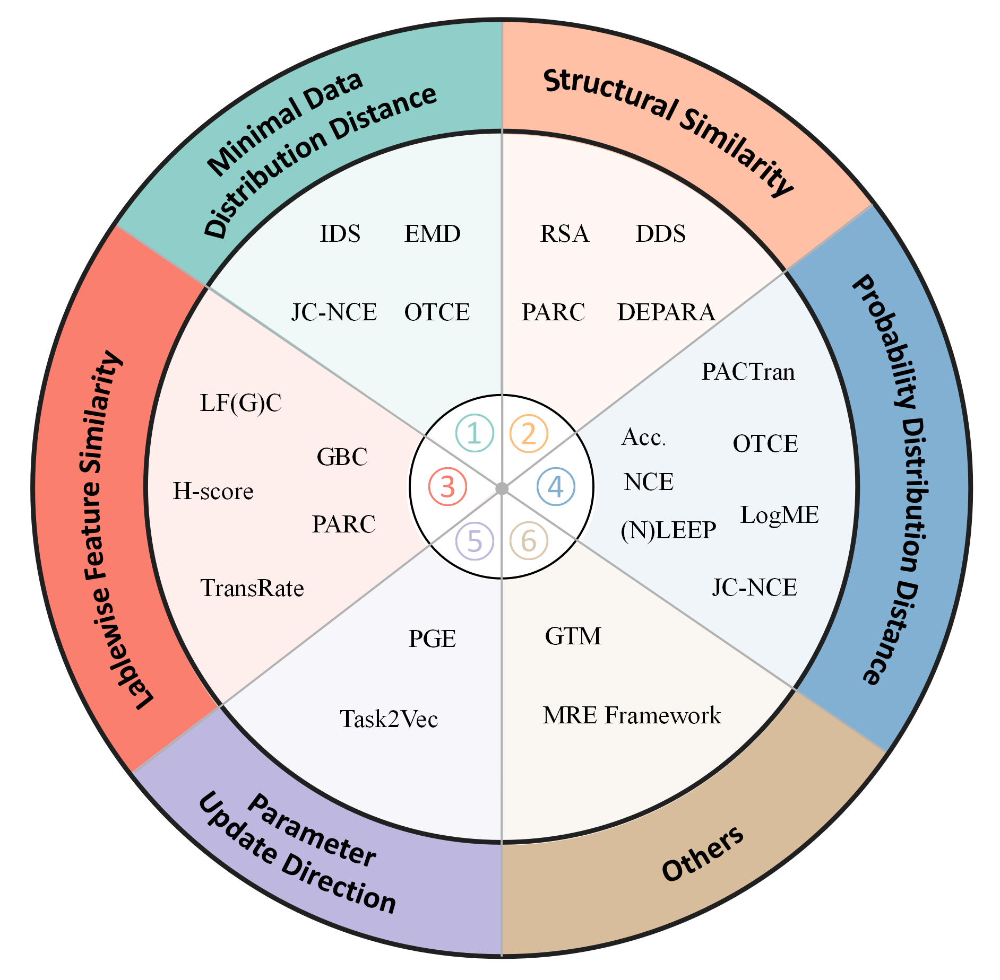
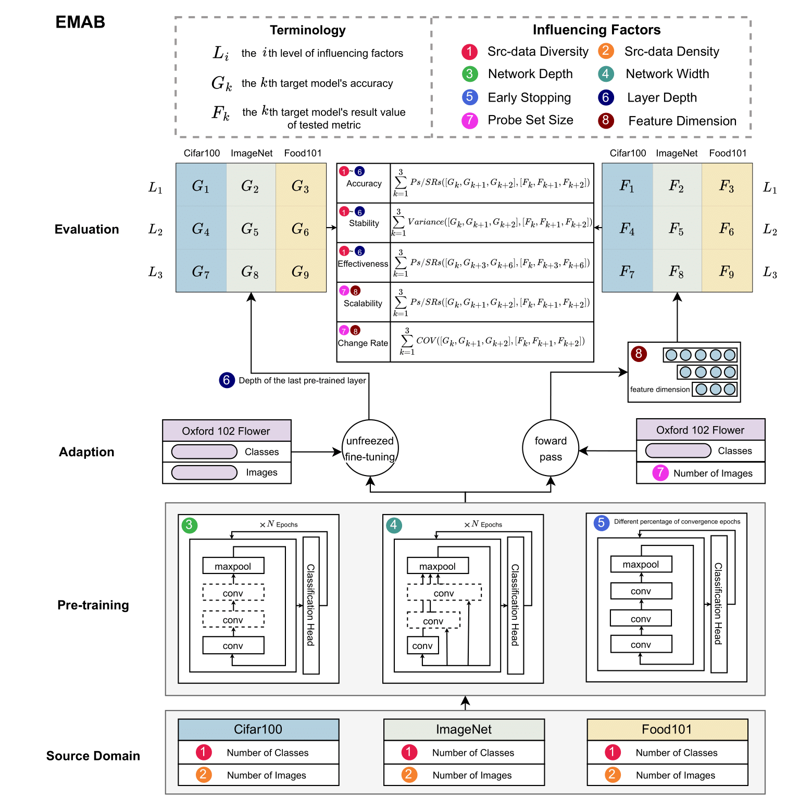

# A Comprehensive Survey and Benchmarking on Deep Model Transferability Evaluation

This is the GitHub repository for the paper **_A Comprehensive Survey and Benchmarking on Deep Model Transferability Evaluation_**. This repository contains the experimental code and the comprehensive survey paper associated with our research, which will be updated in real-time with the latest progress.

## Overview

In this repository, you will find:

- The experimental code used in our survey. (**EMAB analysis** and **estimated transferability evaluation**)
- Link to the original paper on estimated evaluation measures.

## Online Model Evaluation Platform

Based on our survey, we have developed an online model evaluation platform. You can access it at: https://model-evaluation.vipazoo.com.

## Evaluation Measures

The transferability evaluation measures are divided into 6 categories based on their inherent computational strategies, as shown below.

1. **Minimal Data Distribution Distance**: Measures the similarity between two domains based on their data distribution.
2. **Probability Distribution Distance**: Evaluates transferability by comparing probability distributions.
3. **Labelwise Feature Similarity**: Assesses the correlation between features and labels.
4. **Structural Similarity**: Uses structural characteristics of neural networks to measure transferability.
5. **Parameter Update Direction**: Considers the direction of parameter updates during training.
6. **Others**: Includes measures that do not fit neatly into the above categories.

For the convenience of searching, We list the original papers for each measure in the table below. Please refer to the original paper for the attributes, characteristics, and usage scenarios of each measure.
| Measure | Paper |
| ---------------------------------------------------------- | ----------------------------------------------------------------------------------------------------------------------------------------------------------------------------------------------------------------------------------------------------------------- |
| Image Domain Similarity(IDS) | Factors of influence for transfer learning across diverse appearance domains and task types [[paper]](https://ieeexplore.ieee.org/iel7/34/4359286/09625801.pdf) |
| Earth Mover’s Distance(EMD) | Large scale fine-grained categorization and domain-specific transfer learning [[paper]](https://openaccess.thecvf.com/content_cvpr_2018/papers/Cui_Large_Scale_Fine-Grained_CVPR_2018_paper.pdf) |
| Optimal Transport based Conditional Entropy(OTCE) | Otce: A transferability metric for cross-domain cross-task representations [[paper]](https://openaccess.thecvf.com/content/CVPR2021/papers/Tan_OTCE_A_Transferability_Metric_for_Cross-Domain_Cross-Task_Representations_CVPR_2021_paper.pdf) |
| Joint Correspondences Negative Conditional Entropy(JC-NCE) | Practical transferability estimation for image classification tasks [[paper]](https://arxiv.org/pdf/2106.10479) |
| Negative Conditional Entropy (NCE) | Transferability and hardness of supervised classification tasks [[paper]](https://openaccess.thecvf.com/content_ICCV_2019/papers/Tran_Transferability_and_Hardness_of_Supervised_Classification_Tasks_ICCV_2019_paper.pdf) |
| Log Expected Empirical Prediction(LEEP) | Leep: A new measure to evaluate transferability of learned representations [[paper]](http://proceedings.mlr.press/v119/nguyen20b/nguyen20b.pdf) |
| NLEEP | Ranking neural checkpoints [[paper]](https://openaccess.thecvf.com/content/CVPR2021/papers/Li_Ranking_Neural_Checkpoints_CVPR_2021_paper.pdf) |
| PACTran | Pactran: Pac-bayesian metrics for estimating the transferability [[paper]](https://arxiv.org/pdf/2203.05126) |
| Logarithm of Maximum Evidence(LogME) | Logme: Practical assessment of pre-trained models for transfer learning [[paper]](http://proceedings.mlr.press/v139/you21b/you21b.pdf) |
| Label-Feature Correlation(LFC/LGC) | A linearized framework and a new benchmark for model selection for fine-tuning [[paper]](https://arxiv.org/pdf/2102.00084) |
| Gaussian Bhattacharyya Coefficient(GBC) | Transferability estimation using bhattacharyya class separability [[paper]](https://openaccess.thecvf.com/content/CVPR2022/papers/Pandy_Transferability_Estimation_Using_Bhattacharyya_Class_Separability_CVPR_2022_paper.pdf) |
| H-score | An information-theoretic approach to transferability in task transfer learning [[paper]](https://arxiv.org/pdf/2212.10082) |
| TransRate | Frustratingly easy transferability estimation [[paper]](https://proceedings.mlr.press/v162/huang22d/huang22d.pdf) |
| Pairwise Annotation Representation Comparison(PARC) | Scalable diverse model selection for accessible transfer learning [[paper]](https://proceedings.neurips.cc/paper_files/paper/2021/file/a1140a3d0df1c81e24ae954d935e8926-Paper.pdf) |
| Representation Similarity Analysis (RSA) | Representation similarity analysis for efficient task taxonomy & transfer learning [[paper]](http://openaccess.thecvf.com/content_CVPR_2019/papers/Dwivedi_Representation_Similarity_Analysis_for_Efficient_Task_Taxonomy__Transfer_Learning_CVPR_2019_paper.pdf) |
| Duality Diagram Similarity(DDS) | Duality diagram similarity: a generic framework for initialization selection in task transfer learning [[paper]](https://arxiv.org/pdf/2008.02107) |
| DEeP Attribution gRAph (DEPARA) | Depara: Deep attribution graph for deep knowledge transferability [[paper]](http://openaccess.thecvf.com/content_CVPR_2020/supplemental/Song_DEPARA_Deep_Attribution_CVPR_2020_supplemental.pdf) |
| Task2Vec | Task2vec: Task embedding for meta-learning [[paper]](https://openaccess.thecvf.com/content_ICCV_2019/papers/Achille_Task2Vec_Task_Embedding_for_Meta-Learning_ICCV_2019_paper.pdf) |
| Principal Gradient Expectation(PGE) | Transferability estimation based on principal gradient expectation [[paper]]( |

## ESTIMATED MEASURE ANALYSIS BENCHMARK(EMAB)

We provide a comprehensive evaluation framework for estimated transferability measures to assess the accuracy, robustness, scalability, and other properties in multiple independent controlled scenarios. The framework is illustrated in the following figure. The specific usage procedure will be updated later.

## Contributing

We encourage contributions from the community. If you encounter any issues or have suggestions for improvements, please feel free to open an issue or submit a pull request.

## License

This project is licensed under the MIT License - see the [LICENSE](LICENSE) file for details.

## Contact

For any questions or inquiries, please contact us at jinxunwu@zju.edu.cn

We hope this repository serves as a valuable resource for your research and development efforts. Thank you for your interest in our work!
